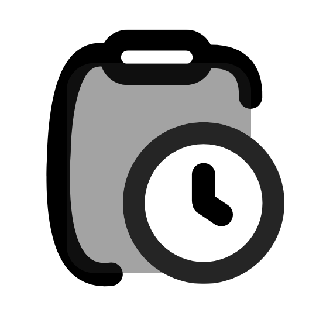

# DonStop

<p align="center">
  
</p>

<p align="center">
	<a href="https://nextjs.org/"></a>
	<a href="https://react.dev/"></a>
	<a href="https://www.typescriptlang.org/"></a>
	<a href="https://tailwindcss.com/"></a>
	<a href="https://zustand-demo.pmnd.rs/"></a>
	<a href="https://dndkit.com/"></a>
	<a href="https://biomejs.dev/"></a>
</p>

Nested task timer built for ADHD focus. Write tasks fast, track time live, finish when done, optionally sync to Google Calendar. Zero friction to start working.

## Demo

https://github.com/user-attachments/assets/457b6fdf-ead1-41c3-9669-9ed8faa23ce8

## Why I built this

Keeping up with school, a part-time SWE job, and learning cybersecurity on the side is hard (especially with ADHD). I wanted something that logs my work as calendar events so I can actually see where my time goes. Turns out seeing your hours stack up in Google Calendar is really motivating, and seeing the gaps where you were just scrolling TikTok is even more motivating.

## AI

Built by me with strong opinions on architecture, file naming, UI, and what "too big" means for a file or folder. Claude (claude-sonnet-4-6) pairs on this project for bug fixes, UI polish, unit tests, drag-and-drop edge cases, Calendar integration, and store logic. It uses my previous projects as style reference so the output actually fits.

## Features

**Tasks**
- Unlimited nesting, inline create/rename/finish/restore/delete/favorite
- Drag and drop (before, after, inside) with overlay and placeholder rendering
- Auto-sort by last activated (most recently worked-on task floats to top)
- Live duration per task and cumulative tracked time
- Start, stop, finish, cancel, reset, transfer time between tasks
- Time edit popover (supports hh:mm:ss, mm:ss, or just seconds)
- Ctrl+Enter to finish the active task from anywhere

**History**
- Full session log with timestamps, durations, and an activity feed
- Activity covers: finish, transfer, reposition, calendar events, settings changes
- Filter activity by type

**Settings**
- Primary color, theme (light/dark/system), timezone, custom cursor toggle
- Clear everything button (with confirmation)

**Google Calendar (optional)**
- Disabled by default, only activates with `NEXT_PUBLIC_GOOGLE_CLIENT_ID`
- Link/unlink account, pick destination calendar, auto-sync on finish
- Dedupe guard so you don't get double events
- Event manager with multi-select delete

**Platform**
- PWA-installable (Chrome address bar > Install DonStop), badge API shows a dot on the taskbar icon when a task is active
- Green favicon + tab title update when working ("ok DonStop" in browser, just "ok" in PWA)
- Local-first, everything persists to localStorage
- 35+ unit tests (node:test)
- Mobile-friendly

**Dev toolbar** (dev only, bottom-right corner)
- Populate fake data, add quick tasks, show tour, copy store JSON, reset everything
- Zero prod bundle impact (dynamic import, dead-code-eliminated in prod)

## Quick Start

```bash
npm install
npm run dev
```

Open http://localhost:3005

Install as PWA: open in Chrome, click the install icon in the address bar. Once installed, you'll get a taskbar badge dot when a task is running.

## Environment

No env vars needed to run locally. Optional:

```env
# enables Google Calendar integration
NEXT_PUBLIC_GOOGLE_CLIENT_ID=your_google_client_id

# used in calendar event descriptions and metadata
NEXT_PUBLIC_APP_URL=https://donstop.vercel.app

# debug logs (default: false)
NEXT_PUBLIC_MALIK_DEBUG=false
```

## Google Calendar Setup

1. Create/select a project in Google Cloud Console
2. Enable Google Calendar API
3. Configure OAuth consent screen
4. Create an OAuth Client ID (Web application)
5. Add authorized origin: http://localhost:3005
6. Add `NEXT_PUBLIC_GOOGLE_CLIENT_ID` to `.env.local`
7. Restart dev server
8. In the app, open Calendar integration and pick a destination calendar

For production, also add your domain to authorized origins and set both env vars in Vercel.

Scopes needed:
- `https://www.googleapis.com/auth/calendar.calendarlist.readonly`
- `https://www.googleapis.com/auth/calendar.events`
- `https://www.googleapis.com/auth/calendar.calendars`

## Scripts

```bash
npm run dev        # dev server on port 3005
npm run build      # production build
npm run start      # production server
npm run check      # TypeScript type check
npm run biome      # lint (read-only)
npm run biome:fix  # lint + auto-fix
npm test           # run unit tests
```
